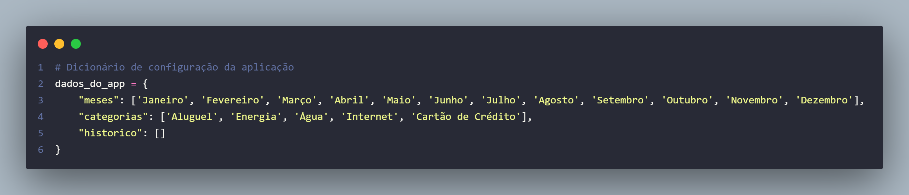

# Oráculo Financeiro 2.0 - Gestor Financeiro Pessoal 🔮

Este projeto é uma evolução da primeira versão do [Oráculo Financeiro](https://github.com/ferlimatos/ABPJ1-Oraculo_Financeiro), focado em transformar uma ferramenta simples num sistema de gestão modular e escalável. O projeto foi desenvolvido para consolidar fundamentos de lógica de programação em Python, utilizando estruturas de dados dinâmicas para gerir receitas e despesas.

## Evoluções da Versão 2.0
- **Armazenamento em Lista de Dicionários**: Diferente de variáveis soltas, agora utilizamos uma lista centralizada que permite o registro ilimitado de transações, facilitando a manipulação dos dados.
- **Menu Interativo com Match Case**: Implementação de um fluxo contínuo que permite ao usuário realizar múltiplas operações em uma única execução.
- **Modularização**: O código foi dividido em funções específicas para cada tarefa (cadastro, cálculo e relatórios), seguindo boas práticas de organização.

## Estrutura de Dados
O sistema utiliza um dicionário principal (dados_do_app) que contém:
- **Configurações**: Listas fixas de meses e categorias.
- **Histórico**: Uma lista onde cada entrada é um dicionário contendo tipo, mes, valor e categoria.

## Funções
**Funções principais**:
- `cadastrar_receita`: Registra entradas financeiras vinculadas a um mês específico.
- `cadastrar_despesa`: Registra gastos categorizados (Aluguer, Energia, etc.).
- `mostrar_saldo`: Exibe o histórico e o saldo de cada mês.
- `mostrar_relatorio`: Gera um resumo detalhado dos saldos acumulados por mês.

**Funções secundárias**:
- `percorrer_mes`: Mostra os meses disponíveis para o usuário.
- `percorrer_despesas`: Mostra os tipos de despesas disponíveis para o usuário.
- `obter_mes_validado`: Função de segurança que garante que apenas meses existentes no sistema sejam selecionados.

## Fluxograma
O fluxo detalha o caminho da informação desde a entrada do dado até a geração do relatório final.

## O que aprendi com o projeto
- Apliquei princípios de Clean Code, utilizando nomes descritivos para funções e variáveis.
- Organizei a estrutura visual do código para garantir legibilidade e manutenção.
- Mapeei informações complexas utilizando dicionários (chaves e valores).
- Estruturei um banco de dados em memória através de listas e coleções dinâmicas.
- Encapsulei lógicas repetitivas em funções modulares com passagem de parâmetros.
- Implementei o match case para a criação de menus organizados.

## Como Executar o Projeto
1.  Certifique-se de ter o **Python 3.x** instalado.
2.  Faça o download ou clone este repositório.
3.  Navegue até a pasta do projeto.
4.  Execute o comando: `python main.py`.

## Tecnologias Utilizadas
- Linguagem: Python 3.x
- Ferramentas: VS Code
- Versionamento: Git (Estratégia de Branches para histórico de evolução)
- Modelagem: Draw.io (para o fluxograma)

## Autora
Fernanda Pereira de Lima Matos – Estudante de Web e Mobile (Escola do Futuro de Goiás)
